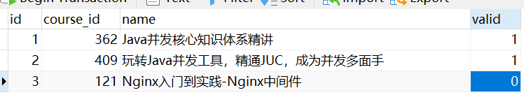
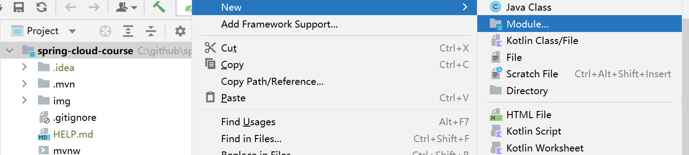
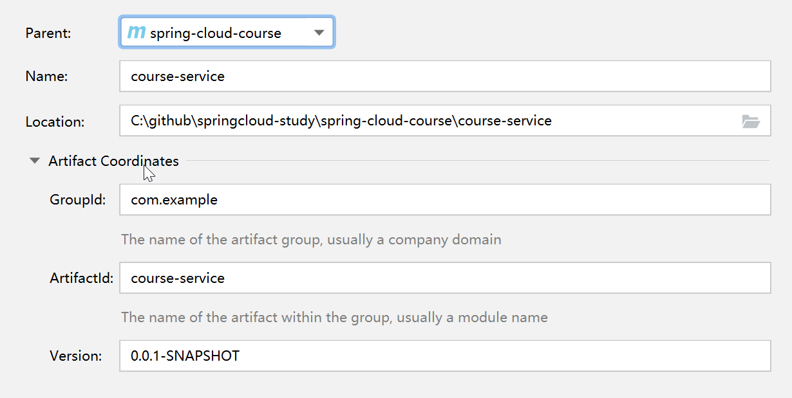
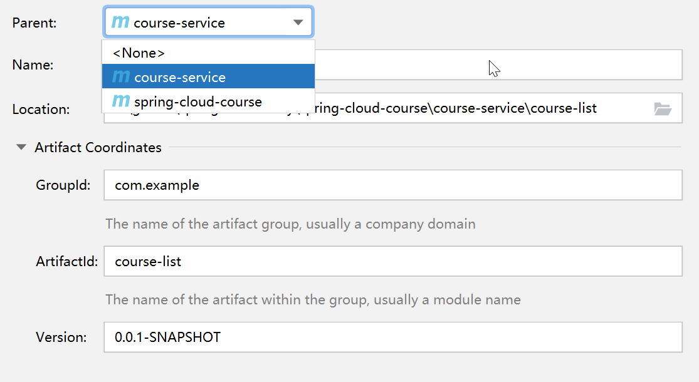
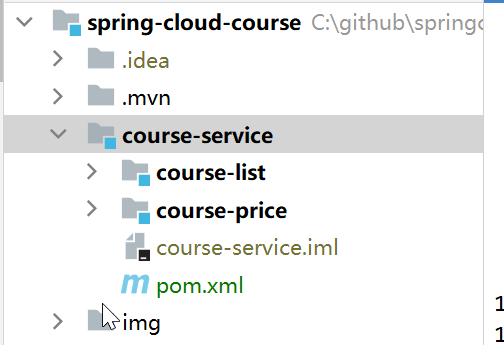
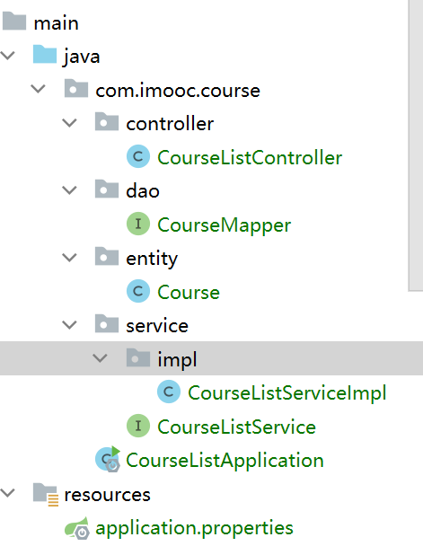
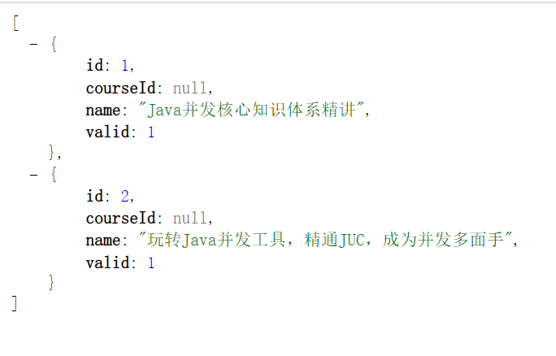
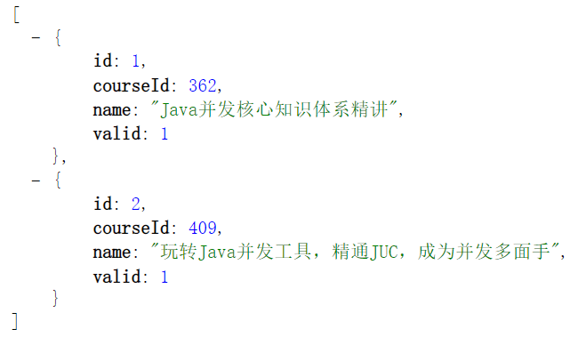

# 项目介绍

基于spring cloud开发课程查询功能

spring cloud的组件学习

模块之间调用. 断路器. 网关

Spring Cloud简洁 -> 目整体设计 -> 课程列表模块开发 -> 课程价格模块开发(重点, 模块调用) -> 服务注册与发现Eureka -> 服务之间调用Feign(简单, 可以应对地址变化情况) -> 负载均衡Ribbon
-> 熔断器Hystrix(兜底) -> 网关Zuul -> 整体测试 -> 项目总结

## Spring Cloud简介

* 成熟的微服务框架, 定位为开发人员提供工具, 以快速构建分布式系统

| 核心组件     | Spring Cloud                                                 |
| ------------ | ------------------------------------------------------------ |
| 服务注册中心 | Spring Cloud Netflix Eureka                                  |
| 服务调用方式 | REST API(Spring Cloud推荐的http方式), Feign(服务调用), Ribbon(负载均衡) |
| 服务网关     | Spring Cloud Netflix Zuul. <br />1. 不同模块的配合流畅 <br />2. 对外部用户就暴露网关即可, 更加安全 <br />3. 可以设置过滤器(鉴权)等功能 |
| 断路器       | Spring Cloud Netflix Hystrix                                 |

核心: 搭建Spring Cloud必不可少的组件, 或者说是90%情况都需要使用的组件

## 项目整体设计

模块:

* 课程列表模块
* 课程价格模块

接口:

* 课程列表接口. 从db中读取内容, 做处理
* 单个课程价格. 入参课程id,
* 整合课程列表和价格. 远程调用获取所有课程列表(第一个模块调用), 通过id查到价格再补充到原来的列表

## 系统数据流向


## 表设计

name -> course_name




## 新建多模块项目

1. Spring Initializr新建项目spring-cloud-course. 2.1.12.RELEASE
1. 删除spring-cloud-course的src文件目录

3. 右击spring-cloud-course, 新建module, maven项目



name: course-service: 存放课程服务



4. 删除course-service中的src. 同时在此module上右键新建模块course-list

注意这里的parent要选择course-service



5. 一样的流程, 再在course-service下新建模块course-price

parent仍未course-service

---

最后的项目结构



**Spring Cloud模块都是一个个spring boot项目**

# 课程列表模块course-list

## 基本设置流程

### 添加依赖+设置springboot启动文件

* 项目为springboot项目, 需要添加相对应的依赖. 

* 同时引入数据库mybatis相关依赖. 

* 还需要添加springboot maven项目的插件

```xml
<?xml version="1.0" encoding="UTF-8"?>
<project xmlns="http://maven.apache.org/POM/4.0.0"
         xmlns:xsi="http://www.w3.org/2001/XMLSchema-instance"
         xsi:schemaLocation="http://maven.apache.org/POM/4.0.0 http://maven.apache.org/xsd/maven-4.0.0.xsd">
    <parent>
        <artifactId>course-service</artifactId>
        <groupId>com.example</groupId>
        <version>0.0.1-SNAPSHOT</version>
    </parent>
    <modelVersion>4.0.0</modelVersion>

    <artifactId>course-list</artifactId>

    <properties>
        <maven.compiler.source>8</maven.compiler.source>
        <maven.compiler.target>8</maven.compiler.target>
    </properties>

    <dependencies>
        <!-- springboot -->
        <dependency>
            <groupId>org.springframework.boot</groupId>
            <artifactId>spring-boot-starter-web</artifactId>
        </dependency>

        <!-- mybatis + db -->
        <dependency>
            <groupId>mysql</groupId>
            <artifactId>mysql-connector-java</artifactId>
        </dependency>
        <dependency>
            <groupId>org.mybatis.spring.boot</groupId>
            <artifactId>mybatis-spring-boot-starter</artifactId>
            <version>2.1.1</version>
        </dependency>
        
        <!-- lombok -->
        <dependency>
            <groupId>org.projectlombok</groupId>
            <artifactId>lombok</artifactId>
            <version>1.18.12</version>
        </dependency>
    </dependencies>

    <build>
        <plugins>
            <plugin>
                <groupId>org.springframework.boot</groupId>
                <artifactId>spring-boot-maven-plugin</artifactId>
            </plugin>
        </plugins>
    </build>
</project>
```

为项目添加启动文件CourseListApplication.java

```java
package com.imooc.course;

import org.springframework.boot.SpringApplication;
import org.springframework.boot.autoconfigure.SpringBootApplication;

/**
 * 项目启动类
 */
@SpringBootApplication
public class CourseListApplication {
    public static void main(String[] args) {
        SpringApplication.run(CourseListApplication.class, args);
    }
}
```

### 添加配置文件, application.properties

端口

数据库driver + url + name +pwd

日志

应用名称

```properties
#port
server.port=8081

#db
spring.datasource.driver-class-name=com.mysql.cj.jdbc.Driver

spring.datasource.url=jdbc:mysql://114.55.64.149:3318/springcloudlearn?serverTimezone=UTC&useUnicode=true&characterEncoding=utf-8&useSSL=true
spring.datasource.username=root
spring.datasource.password=

#log
logging.pattern.console=logging.pattern.console=%clr(%d{${LOG_DATEFORMAT_PATTERN:HH:mm:ss.SSS}}){faint} %clr(${LOG_LEVEL_PATTERN:-%5p}) %clr(${PID:- }){magenta} %clr(---){faint} %clr([%15.15t]){faint} %clr(%-40.40logger{39}){cyan} %clr(:){faint} %m%n${LOG_EXCEPTION_CONVERSION_WORD:%wEx}

#application name
spring.application.name=course-list
```

### 书写基本结构



1. 新建Course entity

```java
package com.imooc.course.entity;

import lombok.Getter;
import lombok.Setter;

/**
 * course 实体类
 */
@Setter
@Getter
public class Course {
    Integer id;
    Integer courseId;
    String courseName;
    Integer valid;
}
```

2. Controller层

```java
package com.imooc.course.controller;

import com.imooc.course.entity.Course;
import com.imooc.course.service.CourseListService;
import org.springframework.beans.factory.annotation.Autowired;
import org.springframework.web.bind.annotation.RestController;

import java.util.List;

@RestController
public class CourseListController {

    @Autowired
    private CourseListService courseListService;
	
    @GetMapping("/courses")
    public List<Course> getCourseList() {
        return courseListService.getCourseList();
    }
}
```

3. Service层

```java
package com.imooc.course.service;


import com.imooc.course.entity.Course;

import java.util.List;


public interface CourseListService {
    public List<Course> getCourseList();
}
```

```java
package com.imooc.course.service.impl;

import com.imooc.course.dao.CourseMapper;
import com.imooc.course.entity.Course;
import com.imooc.course.service.CourseListService;
import org.springframework.beans.factory.annotation.Autowired;
import org.springframework.stereotype.Service;

import java.util.List;

/**
 * 课程服务实现类
 */
@Service
public class CourseListServiceImpl implements CourseListService {

    @Autowired
    private CourseMapper courseMapper;


    @Override
    public List<Course> getCourseList() {
        return courseMapper.findValidCourse();
    }
}
```

4. dao层

```java
package com.imooc.course.dao;

import com.imooc.course.entity.Course;
import org.apache.ibatis.annotations.Mapper;
import org.apache.ibatis.annotations.Select;
import org.springframework.stereotype.Repository;

import java.util.List;

/**
 * 课程mapper类
 */
@Mapper
@Repository
public interface CourseMapper {

    @Select("select * from course where valid = 1")
    public List<Course> findValidCourse();

}
```

## 运行查看效果

### 驼峰对应



可以看到courseId没有赋值, 需要开启驼峰对应

在application.properties中添加配置

```properties
# mybatis Camel-Case
mybatis.configuration.map-underscore-to-camel-case=true
```

重启后查看



### 实体类序列化

上文中直接使用lombok设置getter和setter

如果不适用lombok, 会报错

```
com.fasterxml.jackson.databind.exc.InvalidDefinitionException: No serializer found for class com.imooc.course.entity.Course and no properties discovered to create BeanSerializer (to avoid exception, disable SerializationFeature.FAIL_ON_EMPTY_BEANS) (through reference chain: java.util.ArrayList[0])
```

所以如果不适用lombok, 就让实体类实现接口Serializable并且实现getter和setter

```java
package com.imooc.course.entity;

import lombok.Getter;
import lombok.Setter;

import java.io.Serializable;

/**
 * course 实体类
 */

public class Course implements Serializable {
    Integer id;
    Integer courseId;
    String courseName;
    Integer valid;


    public Integer getId() {
        return id;
    }

    public void setId(Integer id) {
        this.id = id;
    }

    public Integer getCourseId() {
        return courseId;
    }

    public void setCourseId(Integer courseId) {
        this.courseId = courseId;
    }

    public String getName() {
        return name;
    }

    public void setName(String name) {
        this.name = name;
    }

    public Integer getValid() {
        return valid;
    }

    public void setValid(Integer valid) {
        this.valid = valid;
    }
}
```

这里仍然使用按照习惯使用lombok

```java
package com.imooc.course.entity;

import lombok.Getter;
import lombok.Setter;
import lombok.ToString;

import java.io.Serializable;

/**
 * course 实体类
 */
@Getter
@Setter
@ToString
public class Course /*implements Serializable*/ {
    Integer id;
    Integer courseId;
    String courseName;
    Integer valid;
}

```


# 课程价格模块course-price


# 服务注册Eureka


# 服务调用Feign


# Ribbon负载均衡


# Hystrix断路器


# 网关Zuul


# 测试

通过网关与不通过网关


