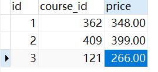
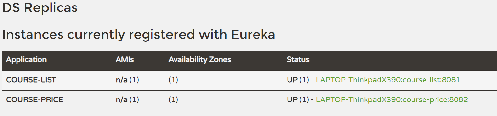
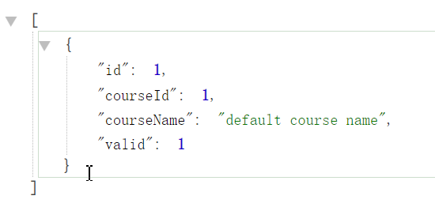

# 项目介绍

基于spring cloud开发课程查询功能

spring cloud的组件学习

模块之间调用. 断路器. 网关

Spring Cloud简洁 -> 目整体设计 -> 课程列表模块开发 -> 课程价格模块开发(重点, 模块调用) -> 服务注册与发现Eureka -> 服务之间调用Feign(简单, 可以应对地址变化情况) -> 负载均衡Ribbon
-> 熔断器Hystrix(兜底) -> 网关Zuul -> 整体测试 -> 项目总结

## Spring Cloud简介

* 成熟的微服务框架, 定位为开发人员提供工具, 以快速构建分布式系统

| 核心组件     | Spring Cloud                                                 |
| ------------ | ------------------------------------------------------------ |
| 服务注册中心 | Spring Cloud Netflix Eureka                                  |
| 服务调用方式 | REST API(Spring Cloud推荐的http方式), Feign(服务调用), Ribbon(负载均衡) |
| 服务网关     | Spring Cloud Netflix Zuul. <br />1. 不同模块的配合流畅 <br />2. 对外部用户就暴露网关即可, 更加安全 <br />3. 可以设置过滤器(鉴权)等功能 |
| 断路器       | Spring Cloud Netflix Hystrix                                 |

核心: 搭建Spring Cloud必不可少的组件, 或者说是90%情况都需要使用的组件

## 项目整体设计

模块:

* 课程列表模块
* 课程价格模块

接口:

* 课程列表接口. 从db中读取内容, 做处理
* 单个课程价格. 入参课程id,
* 整合课程列表和价格. 远程调用获取所有课程列表(第一个模块调用), 通过id查到价格再补充到原来的列表

## 系统数据流向


## 表设计

name -> course_name




## 新建多模块项目

1. Spring Initializr新建项目spring-cloud-course. 2.1.12.RELEASE
1. 删除spring-cloud-course的src文件目录

3. 右击spring-cloud-course, 新建module, maven项目


name: course-service: 存放课程服务


4. 删除course-service中的src. 同时在此module上右键新建模块course-list

注意这里的parent要选择course-service


5. 一样的流程, 再在course-service下新建模块course-price

parent仍未course-service

---

最后的项目结构


**Spring Cloud模块都是一个个spring boot项目**

# 课程列表模块course-list

## 基本设置流程

### 添加依赖+设置springboot启动文件

* 项目为springboot项目, 需要添加相对应的依赖. 

* 同时引入数据库mybatis相关依赖. 

* 还需要添加springboot maven项目的插件

```xml
<?xml version="1.0" encoding="UTF-8"?>
<project xmlns="http://maven.apache.org/POM/4.0.0"
         xmlns:xsi="http://www.w3.org/2001/XMLSchema-instance"
         xsi:schemaLocation="http://maven.apache.org/POM/4.0.0 http://maven.apache.org/xsd/maven-4.0.0.xsd">
    <parent>
        <artifactId>course-service</artifactId>
        <groupId>com.example</groupId>
        <version>0.0.1-SNAPSHOT</version>
    </parent>
    <modelVersion>4.0.0</modelVersion>

    <artifactId>course-list</artifactId>

    <properties>
        <maven.compiler.source>8</maven.compiler.source>
        <maven.compiler.target>8</maven.compiler.target>
    </properties>

    <dependencies>
        <!-- springboot -->
        <dependency>
            <groupId>org.springframework.boot</groupId>
            <artifactId>spring-boot-starter-web</artifactId>
        </dependency>

        <!-- mybatis + db -->
        <dependency>
            <groupId>mysql</groupId>
            <artifactId>mysql-connector-java</artifactId>
        </dependency>
        <dependency>
            <groupId>org.mybatis.spring.boot</groupId>
            <artifactId>mybatis-spring-boot-starter</artifactId>
            <version>2.1.1</version>
        </dependency>
        
        <!-- lombok -->
        <dependency>
            <groupId>org.projectlombok</groupId>
            <artifactId>lombok</artifactId>
            <version>1.18.12</version>
        </dependency>
    </dependencies>

    <build>
        <plugins>
            <plugin>
                <groupId>org.springframework.boot</groupId>
                <artifactId>spring-boot-maven-plugin</artifactId>
            </plugin>
        </plugins>
    </build>
</project>
```

为项目添加启动文件CourseListApplication.java

```java
package com.imooc.course;

import org.springframework.boot.SpringApplication;
import org.springframework.boot.autoconfigure.SpringBootApplication;

/**
 * 项目启动类
 */
@SpringBootApplication
public class CourseListApplication {
    public static void main(String[] args) {
        SpringApplication.run(CourseListApplication.class, args);
    }
}
```

### 添加配置文件, application.properties

端口

数据库driver + url + name +pwd

日志

应用名称

```properties
#port
server.port=8081

#db
spring.datasource.driver-class-name=com.mysql.cj.jdbc.Driver

spring.datasource.url=jdbc:mysql://114.55.64.149:3318/springcloudlearn?serverTimezone=UTC&useUnicode=true&characterEncoding=utf-8&useSSL=true
spring.datasource.username=root
spring.datasource.password=

#log
logging.pattern.console=logging.pattern.console=%clr(%d{${LOG_DATEFORMAT_PATTERN:HH:mm:ss.SSS}}){faint} %clr(${LOG_LEVEL_PATTERN:-%5p}) %clr(${PID:- }){magenta} %clr(---){faint} %clr([%15.15t]){faint} %clr(%-40.40logger{39}){cyan} %clr(:){faint} %m%n${LOG_EXCEPTION_CONVERSION_WORD:%wEx}

#application name
spring.application.name=course-list
```

### 书写基本结构


1. 新建Course entity

```java
package com.imooc.course.entity;

import lombok.Getter;
import lombok.Setter;

/**
 * course 实体类
 */
@Setter
@Getter
public class Course {
    Integer id;
    Integer courseId;
    String courseName;
    Integer valid;
}
```

2. Controller层

```java
package com.imooc.course.controller;

import com.imooc.course.entity.Course;
import com.imooc.course.service.CourseListService;
import org.springframework.beans.factory.annotation.Autowired;
import org.springframework.web.bind.annotation.RestController;

import java.util.List;

@RestController
public class CourseListController {

    @Autowired
    private CourseListService courseListService;
	
    @GetMapping("/courses")
    public List<Course> getCourseList() {
        return courseListService.getCourseList();
    }
}
```

3. Service层

```java
package com.imooc.course.service;


import com.imooc.course.entity.Course;

import java.util.List;


public interface CourseListService {
    public List<Course> getCourseList();
}
```

```java
package com.imooc.course.service.impl;

import com.imooc.course.dao.CourseMapper;
import com.imooc.course.entity.Course;
import com.imooc.course.service.CourseListService;
import org.springframework.beans.factory.annotation.Autowired;
import org.springframework.stereotype.Service;

import java.util.List;

/**
 * 课程服务实现类
 */
@Service
public class CourseListServiceImpl implements CourseListService {

    @Autowired
    private CourseMapper courseMapper;


    @Override
    public List<Course> getCourseList() {
        return courseMapper.findValidCourse();
    }
}
```

4. dao层

```java
package com.imooc.course.dao;

import com.imooc.course.entity.Course;
import org.apache.ibatis.annotations.Mapper;
import org.apache.ibatis.annotations.Select;
import org.springframework.stereotype.Repository;

import java.util.List;

/**
 * 课程mapper类
 */
@Mapper
@Repository
public interface CourseMapper {

    @Select("select * from course where valid = 1")
    public List<Course> findValidCourse();

}
```

## 运行查看效果

### 驼峰对应


可以看到courseId没有赋值, 需要开启驼峰对应

在application.properties中添加配置

```properties
# mybatis Camel-Case
mybatis.configuration.map-underscore-to-camel-case=true
```

重启后查看


### 实体类序列化

上文中直接使用lombok设置getter和setter

如果不适用lombok, 会报错

```
com.fasterxml.jackson.databind.exc.InvalidDefinitionException: No serializer found for class com.imooc.course.entity.Course and no properties discovered to create BeanSerializer (to avoid exception, disable SerializationFeature.FAIL_ON_EMPTY_BEANS) (through reference chain: java.util.ArrayList[0])
```

所以如果不适用lombok, 就让实体类实现接口Serializable并且实现getter和setter

```java
package com.imooc.course.entity;

import lombok.Getter;
import lombok.Setter;

import java.io.Serializable;

/**
 * course 实体类
 */

public class Course implements Serializable {
    Integer id;
    Integer courseId;
    String courseName;
    Integer valid;


    public Integer getId() {
        return id;
    }

    public void setId(Integer id) {
        this.id = id;
    }

    public Integer getCourseId() {
        return courseId;
    }

    public void setCourseId(Integer courseId) {
        this.courseId = courseId;
    }

    public String getName() {
        return name;
    }

    public void setName(String name) {
        this.name = name;
    }

    public Integer getValid() {
        return valid;
    }

    public void setValid(Integer valid) {
        this.valid = valid;
    }
}
```

这里仍然使用按照习惯使用lombok

```java
package com.imooc.course.entity;

import lombok.Getter;
import lombok.Setter;
import lombok.ToString;

import java.io.Serializable;

/**
 * course 实体类
 */
@Getter
@Setter
@ToString
public class Course /*implements Serializable*/ {
    Integer id;
    Integer courseId;
    String courseName;
    Integer valid;
}

```

# 课程价格模块course-price

## 基本配置

### 配置依赖和启动类

一样是springboot应用, 与course-list模块一样配置依赖

```xml
<?xml version="1.0" encoding="UTF-8"?>
<project xmlns="http://maven.apache.org/POM/4.0.0"
         xmlns:xsi="http://www.w3.org/2001/XMLSchema-instance"
         xsi:schemaLocation="http://maven.apache.org/POM/4.0.0 http://maven.apache.org/xsd/maven-4.0.0.xsd">
    <parent>
        <artifactId>course-service</artifactId>
        <groupId>com.example</groupId>
        <version>0.0.1-SNAPSHOT</version>
    </parent>
    <modelVersion>4.0.0</modelVersion>

    <artifactId>course-price</artifactId>

    <properties>
        <maven.compiler.source>8</maven.compiler.source>
        <maven.compiler.target>8</maven.compiler.target>
    </properties>

    <dependencies>
        <!-- springboot -->
        <dependency>
            <groupId>org.springframework.boot</groupId>
            <artifactId>spring-boot-starter-web</artifactId>
        </dependency>
        <!-- mybatis + db -->
        <dependency>
            <groupId>mysql</groupId>
            <artifactId>mysql-connector-java</artifactId>
        </dependency>
        <dependency>
            <groupId>org.mybatis.spring.boot</groupId>
            <artifactId>mybatis-spring-boot-starter</artifactId>
            <version>2.1.1</version>
        </dependency>
        <!-- lombok -->
        <dependency>
            <groupId>org.projectlombok</groupId>
            <artifactId>lombok</artifactId>
            <version>1.18.12</version>
        </dependency>
    </dependencies>
    <build>
        <plugins>
            <plugin>
                <groupId>org.springframework.boot</groupId>
                <artifactId>spring-boot-maven-plugin</artifactId>
            </plugin>
        </plugins>
    </build>
</project>
```

```java
package com.imooc.course;

import org.springframework.boot.SpringApplication;
import org.springframework.boot.autoconfigure.SpringBootApplication;

@SpringBootApplication
public class CoursePriceApplication {
    public static void main(String[] args) {

        SpringApplication.run(CoursePriceApplication.class, args);
    }
}
```

### application.properties

course-list中配置文件类似.

修改端口号, 修改application name

```properties
# port
server.port=8082

# db
spring.datasource.driver-class-name=com.mysql.cj.jdbc.Driver
spring.datasource.url=jdbc:mysql://114.55.64.149:3318/springcloudlearn?serverTimezone=UTC&useUnicode=true&characterEncoding=utf-8&useSSL=true
spring.datasource.username=root
spring.datasource.password=

# mybatis Camel-Case
mybatis.configuration.map-underscore-to-camel-case=true

# log
logging.pattern.console=logging.pattern.console=%clr(%d{${LOG_DATEFORMAT_PATTERN:HH:mm:ss.SSS}}){faint} %clr(${LOG_LEVEL_PATTERN:-%5p}) %clr(${PID:- }){magenta} %clr(---){faint} %clr([%15.15t]){faint} %clr(%-40.40logger{39}){cyan} %clr(:){faint} %m%n${LOG_EXCEPTION_CONVERSION_WORD:%wEx}

#application name
spring.application.name=course-price
```

### 根据courseId查询课程价格方法

1. Controller层

```java
package com.imooc.course.controller;

import com.imooc.course.entity.CoursePrice;
import com.imooc.course.service.CoursePriceService;
import org.springframework.beans.factory.annotation.Autowired;
import org.springframework.web.bind.annotation.GetMapping;
import org.springframework.web.bind.annotation.RestController;

@RestController
public class CoursePriceController {

    @Autowired
    private CoursePriceService coursePriceService;
    @GetMapping("/price")
    public Float getCoursePrice(Integer courseId) {
        final CoursePrice coursePrice = coursePriceService.getCoursePrice(courseId);
        return coursePrice.getPrice();
    }
}
```

2. Service层

```java
package com.imooc.course.service;

import com.imooc.course.entity.CoursePrice;

/**
 * 课程价格服务
 */
public interface CoursePriceService {
    public CoursePrice getCoursePrice(Integer courseId);
}
```

```java
package com.imooc.course.service.impl;

import com.imooc.course.dao.CoursePriceMapper;
import com.imooc.course.entity.CoursePrice;
import com.imooc.course.service.CoursePriceService;
import org.springframework.beans.factory.annotation.Autowired;
import org.springframework.stereotype.Service;

@Service
public class CoursePriceServiceImpl implements CoursePriceService {

    @Autowired
    private CoursePriceMapper coursePriceMapper;

    @Override
    public CoursePrice getCoursePrice(Integer courseId) {
        return coursePriceMapper.findCoursePrice(courseId);
    }
}
```

3. entity层

```java
package com.imooc.course.entity;

import lombok.Getter;
import lombok.Setter;
import lombok.ToString;

@Getter
@Setter
@ToString
public class CoursePrice {
    Integer id;
    Integer courseId;
    Float price;
}
```

4. dao层

```java
package com.imooc.course.dao;

import com.imooc.course.entity.CoursePrice;
import org.apache.ibatis.annotations.Mapper;
import org.apache.ibatis.annotations.Param;
import org.apache.ibatis.annotations.Select;
import org.springframework.stereotype.Repository;

@Mapper
@Repository
public interface CoursePriceMapper {

    @Select("select * from course_price where course_id = #{course_id}")
    public CoursePrice findCoursePrice(@Param("course_id") Integer courseId);
}
```

5. 运行

浏览器中输入查询

`http://localhost:8082/price?courseId=409`

# 服务注册Eureka

多个服务之间建立联系的前提, 服务注册

## Eureka

### 什么是Eureka

Netflix核心子模块, 用于定位服务. 用于服务的注册与发现, 使用**服务的标识符**来访问服务, 不需要每次都要修改服务的配置文件. 系统中其他微服务可以使用Eureka-client连接到Eureka-server, Eureka会帮助来维护各个服务的实时信息. 新模块也可以通过Eureka-server直接找到各个组件服务的地址.

例子: 

* 114: 各个服务提供者登记注册在114, 群众(服务调用者)要使用的时候去询问114. 同时如果店铺关门或者长期不响应, 114会返回关门 -> 心跳机制, 保证信息可靠. 
* 公司物业. 维护办公楼中各个公司的信息. 

### 为什么需要服务注册与发现

移除注册中心, 也可以运行, 但是很繁琐. 如果自己来调用:

* IP变化. 如果A服务提供的是http地址, B服务可以在自己服务配置文件中写死, 然后通过http-client调用对方服务. 但是ip和端口号都有可能变化. 

  * 难以维护. A服务地址变化(常见场景, 机器扩容, 业务变动, 服务器到期等). B服务也要跟着变化. 相当于外部依赖变化, 导致自己的代码也需要做代码变更和重新发布. 成本高

  * 影响面. A服务被许多服务调用. 牵一发而动全身, A服务变化, 那么其他的服务都会不可用

所以手动静态配置很繁琐.

---

改进的思路和方案:

服务的Provider的增减变化应该让Consumer及时知晓, 这种知晓不是代码上的改变, 而是尽量无缝衔接. 即使provider变化频繁, consumer也不需要更改. -> 使用服务注册中心

provider将自己的服务地址登记到服务注册中心, consumer不直接调用provider(的ip和端口), 而是先去注册中心查询到一个地址再去调用 -> 无需人工维护结点; 解决多结点的负载均衡(多结点注册上去, 对于consumer有选择地调用)

### Eureka架构

Eureka Server和Eureka Client


Eureka Server： 服务注册中心. 独立模块, 不要混在业务模块中. 

Service Provider: 服务提供者. 启动后找到Eureka Server注册中心地址, 将自己的内容注册上去. 最开始的时候注册, 后续也会更新.

Service Consumer: 服务消费者. 启动后调用某些服务. 首先去Eureka Server拿到Registry注册表, 通过注册表拿到最新的服务信息. 再Remote Call远程调用Provider.

---

升级为集群:


3个Eureka Server都是服务注册中心. Eureka Server之间共享信息.

Application Service: 服务提供者. 可以在不同的Eureka Server上注册服务. 

Application Client: 服务调用者. 找到任意一个Eureka Server结点即可, 就可以找到整个服务信息. 

---

总结:

Service Provider: 服务提供者. 

* 启动后找到Eureka Server注册中心地址, 将自己的内容注册上去. 
* 负责续约, 定期发送心跳, 告诉注册中心自己的存活.
* 负责下线. 实例正常关闭, 机器缩减等要通知Eureka Server下线

Service Consumer: 服务消费者

* 获取服务. 通过请求得到Eureka Server注册中心, 拿到服务清单
* 进行调用. 根据清单找到需要的信息进行调用.

Eureka Server: 服务注册中心

* 负责维护. 有服务注册需要记录.
* 失效剔除. 每隔一段时间(默认60s)查看哪些服务没有续约, 就剔除. 因为服务提供者突然挂掉, 或者没有能力通知注册中心下线

## Eureka-Server

引入依赖 -> 配置文件 -> 启动注解(整个spring boot就有了Eureka Server的能力)


1. 在spring-cloud-course(根项目)下新建module为eureka-server, maven项目. 与业务代码平级


2. eureka-server修改pom文件

eureka-server.pom

```xml
<?xml version="1.0" encoding="UTF-8"?>
<project xmlns="http://maven.apache.org/POM/4.0.0"
         xmlns:xsi="http://www.w3.org/2001/XMLSchema-instance"
         xsi:schemaLocation="http://maven.apache.org/POM/4.0.0 http://maven.apache.org/xsd/maven-4.0.0.xsd">
    <parent>
        <artifactId>spring-cloud-course</artifactId>
        <groupId>com.example</groupId>
        <version>0.0.1-SNAPSHOT</version>
    </parent>
    <modelVersion>4.0.0</modelVersion>

    <artifactId>eureka-server</artifactId>

    <properties>
        <maven.compiler.source>8</maven.compiler.source>
        <maven.compiler.target>8</maven.compiler.target>
    </properties>

    <dependencies>
        <dependency>
            <groupId>org.springframework.cloud</groupId>
            <artifactId>spring-cloud-starter-netflix-eureka-server</artifactId>
        </dependency>

    </dependencies>

    <build>
        <plugins>
            <plugin>
                <groupId>org.springframework.boot</groupId>
                <artifactId>spring-boot-maven-plugin</artifactId>
            </plugin>
        </plugins>
    </build>
</project>
```

---

eureka-server中引入springcloud eureka依赖的时候, 对于Spring Cloud的版本信息, 不要在每一个模块中维护, 而是统一在最外层pom文件中声明信息. 统一整个项目的springcloud版本.

spring-cloud-course中(根目录pom)

```xml
<!-- 表示Spring Cloud版本 -->
<dependencyManagement>
    <dependencies>
        <dependency>
            <groupId>org.springframework.cloud</groupId>
            <artifactId>spring-cloud-dependencies</artifactId>
            <version>Greenwich.SR5</version>
            <type>pom</type>
            <scope>import</scope>
        </dependency>
    </dependencies>
</dependencyManagement>
```

3. 增加配置文件

配置name

配置端口

配置eureka

```properties
spring.application.name=eureka-server

server.port=8000

# eureka config
# hostname
eureka.instance.hostname=localhost

# eureka client

# fetch-registry: 获取注册表. 不需要同步其他节点数据. 默认true
eureka.client.fetch-registry=false

# 是否将自己注册到Eureka Server(自己是否是eureka client), 默认是true。
# 这里就是server, 没有对外暴露http服务, 其他模块不会调用这里的服务
eureka.client.register-with-eureka=false

# 服务提供的地址
eureka.client.service-url.defaultZone=http://${eureka.instance.hostname}:${server.port}/eureka/
```

4. 声明springboot和EurekaServer启动类

使用注解: @EnableEurekaServer

```java
package com.imooc.course;

import org.springframework.boot.SpringApplication;
import org.springframework.boot.autoconfigure.SpringBootApplication;
import org.springframework.cloud.netflix.eureka.server.EnableEurekaServer;

@EnableEurekaServer
@SpringBootApplication
public class EurekaServerApplication {
    public static void main(String[] args) {
        SpringApplication.run(EurekaServerApplication.class, args);
    }
}
```

5. 启动

启动, 访问`http://localhost:8000/`


## Eureka Client改造

将course-list和course-price注册到eurekaServer上

引入依赖 -> 配置文件

### course-list

1. course-list pom中引入eureka-client依赖

```xml
<!-- eureka-client -->
<dependency>
    <groupId>org.springframework.cloud</groupId>
    <artifactId>spring-cloud-starter-netflix-eureka-client</artifactId>
</dependency>
```

2. application.properties中添加eureka-client配置

启动的时候自动注册到该地址上去

```properties
eureka.client.service-url.defaultZone=http://localhost:8000/eureka/
```

3. 测试

启动Eureka-server, 然后再启动eureka-client

可以看到注册成功


Availability Zones; 可用区. 理解为可以使用的数量

### course-price

与上文类似. 

日志

```
logging.pattern.console=15:49:21.671 - INFO 6692 --- [           main] com.netflix.discovery.DiscoveryClient    : Getting all instance registry info from the eureka server
logging.pattern.console=15:49:21.819 - INFO 6692 --- [           main] com.netflix.discovery.DiscoveryClient    : The response status is 200
```



---

### 注意点

有的时候会在client启动类上增加注解@EnableEurekaClient

但是这里不需要, 因为引入的依赖是`spring-cloud-starter-netflix-eureka-client`, 可以省略client注解

---

[EMERGENCY! EUREKA MAY BE INCORRECTLY CLAIMING INSTANCES ARE UP WHEN THEY'RE NOT. RENEWALS ARE LESSER THAN THRESHOLD AND HENCE THE INSTANCES ARE NOT BEING EXPIRED JUST TO BE SAFE](https://developer.aliyun.com/article/651183)

# 服务调用Feign(Open Feign)

## Feign介绍

Feign: 声明式, 模板化的http客户端. spring cloud中使用Feign, 很方便的调用http远程请求. 

* 方便: 调用远程请求就像调用本地方法

* Feign基于接口和注解的方式实现


1. Producer向注册中心(Eureka)注册
2. Consumer从注册中心中获取可以使用的服务地址. Consumer使用Ribbon做负载均衡
3. 一般是http请求. 如果不使用Feign, 就需要自己手写http请求, 参数, 请求头, cookie等. -> 使用Feign

## 集成Feign

引入依赖 -> 配置文件 -> 注解

项目中是course-price调用course-list服务, 所以在course-price中引入

1. price项目中引入pom依赖

```xml
<!-- openfeign -->
<dependency>
    <groupId>org.springframework.cloud</groupId>
    <artifactId>spring-cloud-starter-openfeign</artifactId>
</dependency>
```

2. 配置

在application.properties中添加负载均衡配置 -> 后节

这里先实现最基本的调用

3. 添加启动注解

启动类中添加注解@EnableFeignClients

```java
package com.imooc.course;

import org.springframework.boot.SpringApplication;
import org.springframework.boot.autoconfigure.SpringBootApplication;
import org.springframework.cloud.openfeign.EnableFeignClients;

@SpringBootApplication
@EnableFeignClients
public class CoursePriceApplication {
    public static void main(String[] args) {

        SpringApplication.run(CoursePriceApplication.class, args);
    }
}
```

4. 添加Feign Client

```java
package com.imooc.course.client;


import com.imooc.course.entity.Course;
import org.springframework.cloud.openfeign.FeignClient;
import org.springframework.web.bind.annotation.GetMapping;

import java.util.List;

/**
 * 课程列表Feign客户端
 * 根据course-list中的定义来使用
 *
 * 因为服务很多, 所以需要添加参数表明是哪个服务的
 */
@FeignClient("course-list")
public interface CourseListClient {
    
    @GetMapping("/courses")
    List<Course> getCourseList();
    
}
```

@FeignClient("course-list"): 因为服务很多, 所以需要添加参数表明是哪个服务的

其中的Course需要添加依赖


查看course-price的pom文件, 其中增加了依赖

```xml
<!-- course-list course -->
<dependency>
    <groupId>com.example</groupId>
    <artifactId>course-list</artifactId>
    <version>0.0.1-SNAPSHOT</version>
    <scope>compile</scope>
</dependency>
```

5. Controller中调用client

这里拿到接口后结果即可. 后续再做负载均衡和断路器等扩展处理

```java
package com.imooc.course.controller;

import com.imooc.course.client.CourseListClient;
import com.imooc.course.entity.Course;
import com.imooc.course.entity.CoursePrice;
import com.imooc.course.service.CoursePriceService;
import org.springframework.beans.factory.annotation.Autowired;
import org.springframework.web.bind.annotation.GetMapping;
import org.springframework.web.bind.annotation.RestController;

import java.util.List;

@RestController
public class CoursePriceController {

    @Autowired
    private CoursePriceService coursePriceService;

    @Autowired
    private CourseListClient feignClient;

    @GetMapping("/price")
    public Float getCoursePrice(Integer courseId) {
        final CoursePrice coursePrice = coursePriceService.getCoursePrice(courseId);
        return coursePrice.getPrice();
    }

    // course-price中调用course-list
    @GetMapping("/coursesInPrice")
    public List<Course> getCourseListInPrice() {
        return feignClient.getCourseList();
    }
}
```

6. 测试

运行三个springboot项目

浏览器访问: `http://localhost:8082/coursesInPrice`


可以看到price中调用到了模块list的接口, 远程调用成功

# Ribbon负载均衡

## 负载均衡的类型

* 客户端负载均衡(Ribbon)

* 服务端负载均衡(Nginx)

Client端LB: 调用时, client可以得知有多少结点提供服务, 由client考虑调用哪个, 不让某个结点压力过大

Server端LB: 所有请求打到nginx结点, 由nginx进行分发.

两种LB可以同时存在. 对于大型项目, 对于client自然是用nginx不对client暴露. 但是对于内部服务之间的相互调用就咩有必要使用nginx, 如果使用nginx就是无效加长链路, 所以在服务内部之间的调用使用Ribbon即可.

## 负载均衡策略

RandomRule: 随机策略. 每次都随机调用

RoundRobinRule: 轮询策略, 使用最多. 

ResponseTimeWeightedRule: 加权策略, 根据每一个Server的平均响应时间动态加权. 判断评估, cpu差异时, 根据平均响应时间给更快的cpu更多的请求压力.

---

在项目中配置不同的负载均衡方式:

Ribbon.NFLoadBalancerRuleClassName

## course-price

course-price中调用其他模块, 因此在course-price中添加lb

1. 在application.properties中添加配置

首先指定对哪个模块要负载均衡

```properties
# ribbon lb, 首先指定对哪个模块要负载均衡
course-list.ribbon.NFLoadBanlancerRuleClassName=com.netflix.loadbalancer.RoundRobinRule
```

# Hystrix断路器

## 为什么需要断路器

如果出现了延迟, 会怎么样?


client的一条请求依赖多个模块, 碰巧dependency I出现了问题, 导致了很大的延迟. 假设该服务I是链路中的入口(例如查询用户信息), 那么其他模块也无法工作, 卡在该模块. 其他模块也无法工作, user就会感觉到卡顿.

假设该服务提供给多个用户, 那么其他的接口就都无法正常运转. 那么一但有用户信息发过来, 就会卡在该模块. 请求卡在该模块, 同时之前链路拿到的模块也不会释放, 例如前面有模块获得到数据库连接, 由连接池管理, 如果很多连接数上来, 并且得不到释放, 那么数据库就会被拖垮. -> 最终导致数据库不可用, 最后整个资源都不可用.


所以Spring cloud就实现了断路器, 起到了保护作用. 当某一个单元发生故障的时候, 使用断路器将该单元隔离出去, 保护整个系统. -> Hystrix

当某个服务发生了错误, 返回默认响应或者错误响应, 而不是让用户长时间等待. 不会让占用的资源得不到释放. 避免分布式系统中故障的蔓延.

例如: 天猫下单或者访问商品详情的时候, 流量大的时候返回页面"流量太大请稍后重试". 这就是天猫的提供的短路功能. 提供兜底逻辑

## 编码引入

依赖 -> 配置 -> 注解 -> 发生错误时的处理逻辑

此处在price中添加断路器, 因为price中无法保证list的启动与否

1. price添加断路器pom依赖

```xml
<!-- hystrix 断路器 -->
<dependency>
    <groupId>org.springframework.cloud</groupId>
    <artifactId>spring-cloud-starter-netflix-hystrix</artifactId>
</dependency>
```

2. 添加配置

```properties
# hystrix断路器配置
feign.hystrix.enabled=true
```

3. 添加启动注解

断路器注解: @EnableCircuitBreaker

```java
@SpringBootApplication
@EnableFeignClients
@EnableCircuitBreaker
public class CoursePriceApplication {}
```

4. 编写断路器生效时候的处理

course-price中会发生错误的就是在调用course-list的CourseListClient接口中

对注解@FeignClient添加参数fallback, 指定错误处理方法.

默认情况下调用远端服务. 如果发生错误, 就执行指定的错误处理方法CourseListClientHystrix

```java
package com.imooc.course.client;


import com.imooc.course.entity.Course;
import org.springframework.cloud.openfeign.FeignClient;
import org.springframework.web.bind.annotation.GetMapping;

import java.util.List;

/**
 * 课程列表Feign客户端
 * 根据course-list中的定义来使用
 *
 * 因为服务很多, 所以需要添加参数表明是哪个服务的
 */
@FeignClient(value = "course-list", fallback = CourseListClientHystrix.class)
public interface CourseListClient {

    @GetMapping("/courses")
    List<Course> getCourseList();

}
```

CourseListClientHystrix需要添加@Component注解

```java
package com.imooc.course.client;

import com.imooc.course.entity.Course;
import org.springframework.stereotype.Component;

import java.util.ArrayList;
import java.util.Collections;
import java.util.List;

/**
 * 断路器实现类
 */
@Component
public class CourseListClientHystrix implements CourseListClient {

    @Override
    public List<Course> getCourseList() {
        final List<Course> defaultCourse = new ArrayList<>();
        // 实际生产中添加首页课程或者热卖课程
        Course course = new Course();
        course.setId(1);
        course.setCourseId(1);
        course.setCourseName("default course name");
        course.setValid(1);
        defaultCourse.add(course);
        return defaultCourse;

        // 或者直接返回空列表
        // return Collections.emptyList();
    }
}
```

5. controller中报错

编写完成后发现Controller中的注入参数报错


不管他也没有关系, 对于feign来说, 他是在调用的时候才知道应该去选择哪一个注入.

或者添加@Primary注解

```java
@FeignClient(value = "course-list", fallback = CourseListClientHystrix.class)
@Primary
public interface CourseListClient {}
```

6. 测试

course-list, course-price, eureka-Server都启动后

浏览器: `http://localhost:8082/coursesInPrice`. course-price模块可以正常获得course-list数据.


停止course-list或者给course-list中方法getCourseList下断点

断路器触发, 返回处理方法



# 整合两个服务

1. CourseAndPrice, 课程和价格匹配产生的融合类

```java
package com.imooc.course.entity;

import lombok.Getter;
import lombok.Setter;
import lombok.ToString;

/**
 * 课程和价格融合类
 */
@Getter
@Setter
@ToString
public class CourseAndPrice {
    Integer id;
    Integer courseId;
    String courseName;
    Float price;
}
```

id, courseId, courseName从Course-list中获取. price从本模块获取

2. Controller新增查询

```java
@GetMapping("/coursesAndPrice")
public List<CourseAndPrice> getCourseAndPrice() {
    return coursePriceService.getCourseAndPrice();
}
```

3. Service层

接口中添加

```java
public interface CoursePriceService {

    public CoursePrice getCoursePrice(Integer courseId);

    public List<CourseAndPrice> getCourseAndPrice();

}
```

impl中新增实现, 做拼接的具体工作

```java
/**
     * 课程列表和课程price做融合处理
     *
     * 首先从list模块中拿到所有列表
     */
@Override
public List<CourseAndPrice> getCourseAndPrice() {
    List<CourseAndPrice> courseAndPriceList = new ArrayList<>();

    List<Course> courseList = feignClient.getCourseList();
    for (Course course : courseList) {
        CoursePrice coursePrice = getCoursePrice(course.getCourseId());
        Optional.ofNullable(coursePrice).ifPresent(price -> {
            CourseAndPrice courseAndPrice = new CourseAndPrice();
            courseAndPrice.setId(course.getId());
            courseAndPrice.setCourseId(course.getCourseId());
            courseAndPrice.setCourseName(course.getCourseName());
            courseAndPrice.setPrice(price.getPrice());
            courseAndPriceList.add(courseAndPrice);
        });
    }

    return courseAndPriceList;
}
```

4. 运行

浏览器访问: `http://localhost:8082/coursesAndPrice`


# 网关Zuul

## 为什么需要网关

如果没有网关: 

* 签名校验, 登录校验冗余问题. 各个模块独立, 没有网关的话就需要在每一个模块都加校验的逻辑. 相似代码, 冗余

Spring Cloud Zuul, Spring Cloud中的组件, 与Eureka整合, 自己也是Eureka的一个Client, 需要注册到Eureka中, 通过Eureka获取其他微服务模块的信息. 得到其他模块信息后, 将这些其他模块的信息注册到网关模块, 将访问进行收口. 例如: 上面的course-list是8081, course-price是8082, zuul是8083, 外部调用不用再根据需要的服务去不同模块, 而是直接访问网关(8083端口)而不必区分各个模块, 由网关做区分.

另外的一大功能: 只需要在Zuul上做信息校验. 后续模块无需校验.

## Zuul

API网关允许将API请求(内部或外部)路由到正确的位置


user访问服务的时候并不会直接访问到右侧的服务, 而是访问网关, 网关从注册中心把服务信息拉下来, 网关再进行正确的转发即可. -> 网关的路由功能

网关最重要的两个功能: 统一鉴权和正确路由

## 集成Zuul

把Zuul注册到Eureka这个注册中心

引入依赖

配置路由地址

---

### 网关注册到Eureka

1. 在根目录下新增模块course-zuul, maven项目

2. pom中引入依赖

eureka-client, zuul

```xml
<?xml version="1.0" encoding="UTF-8"?>
<project xmlns="http://maven.apache.org/POM/4.0.0"
         xmlns:xsi="http://www.w3.org/2001/XMLSchema-instance"
         xsi:schemaLocation="http://maven.apache.org/POM/4.0.0 http://maven.apache.org/xsd/maven-4.0.0.xsd">
    <parent>
        <artifactId>spring-cloud-course</artifactId>
        <groupId>com.example</groupId>
        <version>0.0.1-SNAPSHOT</version>
    </parent>
    <modelVersion>4.0.0</modelVersion>

    <artifactId>course-zuul</artifactId>

    <properties>
        <maven.compiler.source>8</maven.compiler.source>
        <maven.compiler.target>8</maven.compiler.target>
    </properties>

    <dependencies>

        <!-- eureka-client -->
        <dependency>
            <groupId>org.springframework.cloud</groupId>
            <artifactId>spring-cloud-starter-netflix-eureka-client</artifactId>
        </dependency>

        <!-- zuul -->
        <dependency>
            <groupId>org.springframework.cloud</groupId>
            <artifactId>spring-cloud-starter-netflix-zuul</artifactId>
        </dependency>

    </dependencies>

    <build>
        <plugins>
            <plugin>
                <groupId>org.springframework.boot</groupId>
                <artifactId>spring-boot-maven-plugin</artifactId>
            </plugin>
        </plugins>
    </build>
</project>
```

3. springboot启动类

网关启动类, @EnableZuulProxy说明是zuul网关

```java
package com.imooc.course;

import org.springframework.boot.SpringApplication;
import org.springframework.boot.autoconfigure.SpringBootApplication;
import org.springframework.cloud.netflix.zuul.EnableZuulProxy;

@EnableZuulProxy
@SpringBootApplication
public class ZuulGatewayApplication {
    public static void main(String[] args) {
        SpringApplication.run(ZuulGatewayApplication.class, args);
    }
}
```

4. 配置application.properties

```properties
#application name
spring.application.name=course-zuul

# port
server.port=9000

# log
logging.pattern.console=logging.pattern.console=%clr(%d{${LOG_DATEFORMAT_PATTERN:HH:mm:ss.SSS}}){faint} %clr(${LOG_LEVEL_PATTERN:-%5p}) %clr(${PID:- }){magenta} %clr(---){faint} %clr([%15.15t]){faint} %clr(%-40.40logger{39}){cyan} %clr(:){faint} %m%n${LOG_EXCEPTION_CONVERSION_WORD:%wEx}


# eureka-client server地址
eureka.client.service-url.defaultZone=http://localhost:8000/eureka/
```

5. 启动查看是否注册到了Eureka上

访问`localhost:8000`


### 网关访问其他服务

网关对其他模块默认的路由地址配置

`http://localhost:9000/course-list/courses`


# 测试

通过网关与不通过网关


